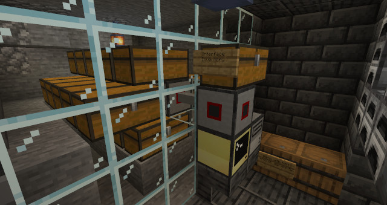

# Virtual Inventory System for CC:Tweaked
It will probably work with other ComputerCraft versions too.
---
## Usage
Attach a wired modem to your CC computer/turtle and add a bunch of inventories to that network, then
download the `virtualinventory` folder to your computer/turtle and
run the script `invent.lua` to launch into the virtual inventory system.

From there you will need to setup/configure the system, this can be done with the commands `cfgprint`, `cfgset`, `cfgget`, and `cfgsave`, or you can
exit out of the program and edit the config file manually if you really want to.

You'll need to set `interface` in the config to be the name of the peripheral/turtle that you
want items to be pushed in and out of for interfacing with the system (This has to be the peripheral/turtle's name on the system's network, not its label.),
and you should set `modemside` to be the side of your computer/turtle that has the system's modem placed on it.

While the system will probably still work without setting `modemside`, if you're going to be using multiple modems on one computer, then you should set it.

After you've set the configuration variables then **please make sure to save them with `cfgsave`**, then restart the program.

Now that the system is configured, you should be good to go. Type in `help` to see a list of commands.

---
### What a fully set up inventory system might look like:

---
I recommend launching the system from `startup.lua` if you want to dedicate a whole computer for this.